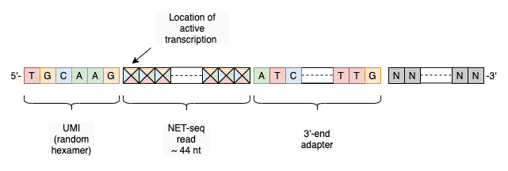

# NET-seq Pipeline

The rdshear/netseq workflow transforms the raw sequence reads from the NET-seq assay to occupancy counts.

## Overview

NET-seq (native elongating transcript sequencing) reports the strand-specific density of active RNA elongation density at single nucleotide resolution (Churchman 2011, 2012). 
The protocol results in a library of strand-specific short cDNA fragments, the 5'-end of which corresponds to the location of active elongation at the moment the sample was harvested.

The input to this pipeline is single-ended sequencing reads



The pipeline takes as input a single-end FASTQ file, optionally gz compressed. 
Alternatively, given an [NCBI Sequence Read Archive](https://www.ncbi.nlm.nih.gov/sra) run identifier, the pipeline will automatically download the file from SRA.

*Caution: Using SRA in GCP and AWS:* As of February 2022, NCBI appears to block access anonymous access to SRA public internet delivery from within GCP and AWS address spaces. 
If pulling from SRA, we suggest using the NCBI (Cloud Data Delivery Service)[https://www.ncbi.nlm.nih.gov/sra/docs/data-delivery/] to transfer SRA fastq files to your GCP or AWS bucket.

The primary output of the pipeline is a pair of bedgraph files carrying the count at each nucleotide position.
A pair of corresponding bedgraph files is created that report the coverage of multi-mapped regions for this sample.
These are referred to as masks and may be used to treat multi-mapped regions as censored instead of bearing an occupancy score of zero.

### Processing Steps

1. [sra-tools/fastp-dump](https://github.com/ncbi/sra-tools) (optional)
    * Read public SRA archive data
2. [fastp](https://github.com/OpenGene/fastp)
    * Report on characteristics of FASTQ file
    * Remove reads of poor quality
    * Trim the 3'-end adapter
    * Trim the UMI sequence at the 5'-end
    * Remove duplicates (amplicons and optical duplicates)
3. [STAR](https://github.com/alexdobin/STAR)
    * Read and pre-process the reference genome
    * Align to genome
    * Remove ambiguous alignments ("multimappers)
    * Generate coordinate-sorted BAM file
4. [bedtools](https://github.com/arq5x/bedtools2/)
    * Create the bedgraph files

### Example inputs

#### Local fastq file

```
{
    "netseq.inputFastQ": "/n/groups/example/data/S005/wt-1.fastq.gz.1"
}
```

#### Fastq file from NCBI Sequence Read Archive
```
{
    "netseq.sampleName": "wt-1",
    "netseq.sraRunId": "SRR12840066"
}
```

### Time and cost estimates

|Sample Name|Reads|Bases|Duration|Cost|
|-----------|-----|-----|--------|----|
|SRR12840066|4.03G|52.97M|26 min|$0.02|

### Limitations

* This workflow has been 
    * tested only on terra.bio
    * tested only with _S. cerevisiae_ samples and the sacCer3 geneome 
    * tested only with hexamer UMIs

## Technical notes
### Preprocessing with fastp

Traditionally, preprocessing of raw read data (QC, adapter trimming, UMI removal) has been accomplished with seperate programs.
The fastp program (Chen 2018) is not only quite fast, but also performs all of these function in a single pass.
Furthermore, fastp (since version 0.21) will remove duplicate reads tagged with a UMI random hexamer.

### STAR aligner configuration

The STAR aligner has been configured to assume that no sequences are spliced. 
We believe that this is the appropriate assumption.
After trimming, the average read length of each nascent RNA is only 44 nt. 
Chance of a nascent co-transcrptionally spliced read is low.
## Detailed Instructions
### Input

|Parameter|Type|Description|Default Value|
|---------|----|-----------|-------------|
|||**Required Parameters**||
|refFasta|String|Uri to genome geference gile, FASTA format|_Note 1_|
|genomeName|String|UCSC genome version name|sacCer3|
|inputFastQ|File|The reads to be processed in fastq format Extension must be ".fastq", ".fastq.gz" or ".fastq.gz.1"||
|sraRunId|String|An SRA run identifier, e.g. SRR12840066. If inputFastQ is absent, then sraRunId must be present. If both are present, inputFastQ takes presidence.||
|sampleName|String|An identifier for the sample in a format compatible with file names.|_Note 2_|
|||**Preprocessing Parameters**||
|maxReadCount|Int|If defined and greater than zero, then only the first _n_ reads will be processed. Useful for testing, but not for downsampling|0|
|adapterSequence|String|The 3'-end adapter sequence|ATCTCGTATGCCGTCTTCTGCTTG|
|umiWidth|Int|The number of nucleotides in the UMI. Zero indicates that no UMI is present, in which case no duplication will be performed|6|
|dupCalcAccuracy|Int|An integer between 1 and 5. Larger number implies higher accuracy but more memory. See [fastp](https://github.com/OpenGene/fastp) for details. |3|
|minimumReadLength|Int|Minimum length of read prior to alignment after adapter and UMI removal|24|
|||**STAR Aligner Parameters**||
|outSAMmultNmax|Int|Default to outputting primary alignment only. The number of alignments returned for each read. If 1, then no multimmappers are returned|1|
|outFilterMultiMax|Int|If a read has multimappers in excess of this paramter, then the read is disreagarded. The default value 1 implies that only uniquely mapped reads will be reported.|1|
|||**Environmental Parameters**||
|netseq_docker|String|Override the name of the Docker image invoked by the workflow.|rdshear/netseq|
|preemptible|Int|Applicable to Google cloud (GCP). The default value, 1, indicates that each task will be attempted first on a [spot instance](https://cloud.google.com/spot-vms). If spot instance is preemted, then it will be run on a standard on-demand instance   see [Cromwell Documentation](https://cromwell.readthedocs.io/en/stable/RuntimeAttributes/#preemptible) for details. *Caution* setting the preemptible parameter to zero is likely to dramatically incrase the cost running the workflow.|1|
memory|String|The amount of RAM to use. The value is [dependent on the backend platform](https://cromwell.readthedocs.io/en/stable/RuntimeAttributes/#memory). For [terra.bio]("https://terra.bio), the value _n_G indicates that it least _n_GiB are required to run the workflow |8G|
|threads|Int|The number of cpus requested to run the workflow|4|

_Note 1_: `https://hgdownload.soe.ucsc.edu/goldenPath/sacCer3/bigZips/sacCer3.fa.gz`

_Note 2_: For example, if sampleName is "wt-1", then the plus-strand bedgraph output will have the filename "wt-1.pos.bedgraph.gz". If the parameter is not set, then it Will be constructed from the inputFastQ parameter file base name if defined, _viz._ "wt-1" from inputFastQ "wt-1.fastq.gz". If inputFastQ is not defined, then the sraRunId, _viz._ "SRR12840066".

## Output

|Parameter|Type|Format|Example|
|---------|----|-----------|-------|
|output_bam|File|BAM|wt-1.bam|
|bedgraph_pos|File|bedgraph (+) strand|wt-1.pos.bedgraph.gz|
|bedgraph_neg|File|bedgraph (-) strand|wt-1.neg.bedgraph.gz|
|mask_pos|File|bedgraph (+) strand|wt-1.mask_pos.bedgraph.gz|
|mask_neg|File|bedgraph (-) strand|wt-1.mask_neg.bedgraph.gz|
|alignment_log|File|text|wt-1.Log.final.out|
|fastp_report_html|File|html report|wt-1.fastp.html|
|fastp_report_json|File|json|wt-1.fastp.json|

## References

Chen, S., Zhou, Y., Chen, Y., & Gu, J. (2018). fastp: an ultra-fast all-in-one FASTQ preprocessor. Bioinformatics , 34(17), i884–i890.

Churchman, L. S., & Weissman, J. S. (2011). Nascent transcript sequencing visualizes transcription at nucleotide resolution. Nature, 469(7330), 368–373.

Churchman, L. S., & Weissman, J. S. (2012). Native elongating transcript sequencing (NET-seq). Current Protocols in Molecular Biology / Edited by Frederick M. Ausubel... [et Al.], 1(SUPPL.98), 1–17.
